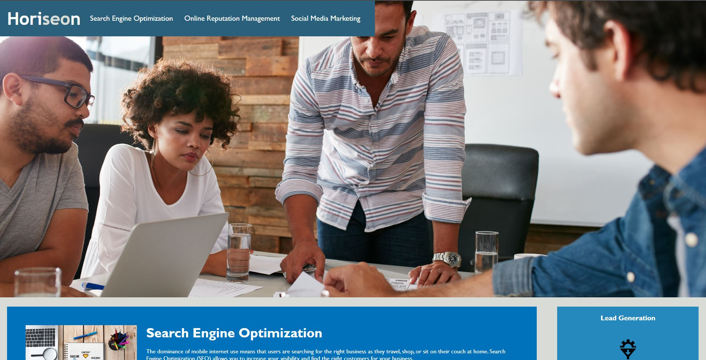
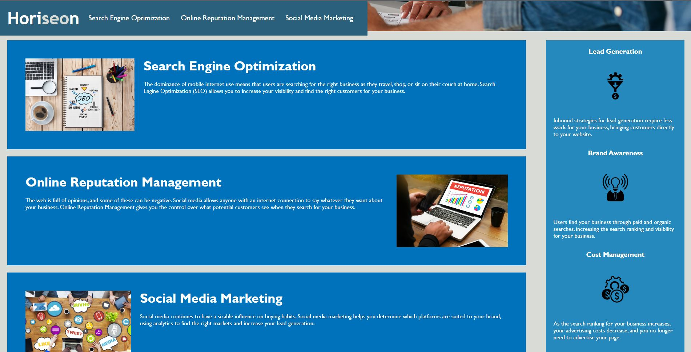

# WEEK-1-PROJECT\DEVELOP

# CHANGES MADE

Multiple *minor* issues came up involving the readablility and easy access for a second set of eyes to look at including-

  -Fixed labeling and readability including adding "headers" "footers" and "sections"

  -Added "alt" elements explaining images for users with screen readers 

  -Added multiple comment sections explaining certain lines of code

  -Organized some lines of code to make it neat and easy to read

  # Description

  Horiseon is a company that allows users and consumers to manage and optimize their social media platform. The target audience is other companies looking to expand their name and platform by using Horiseons tools.

  # User story

  * As a social media user I want to be able to optimize and manage my social media through this website

# Tech Used

* HTML

* CSS

# SCREENSHOTS

# LINKS

[Deployed-Application](https://hunterbrennan1.github.io/Horiseon-Landing-Page/)

[Repo-Link](https://github.com/HunterBrennan1/Horiseon-Landing-Page)

